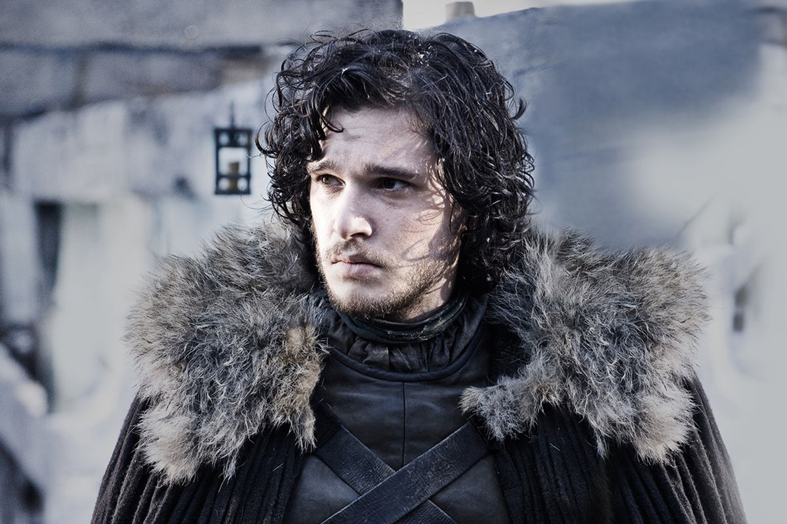
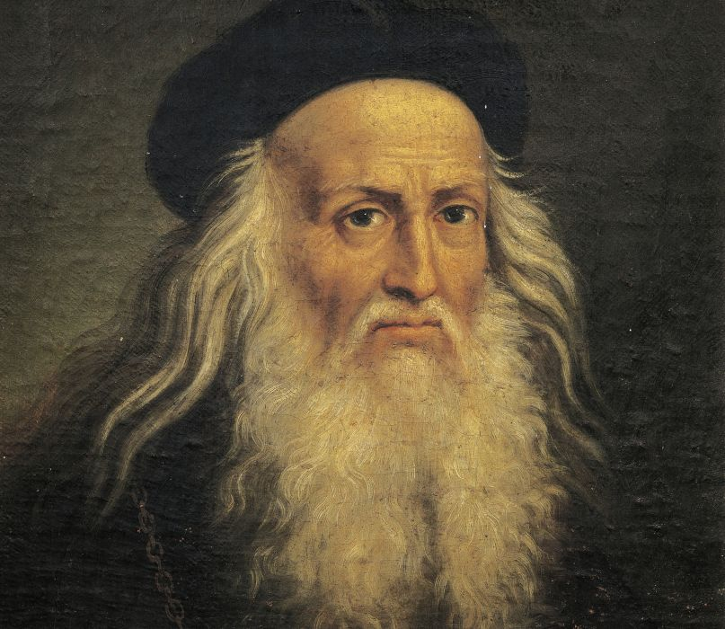
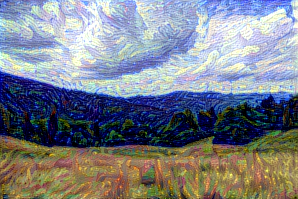
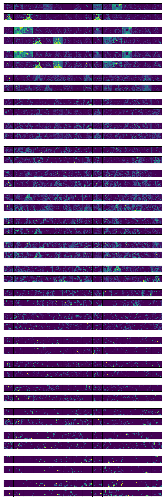
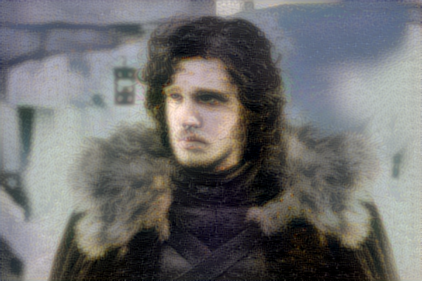
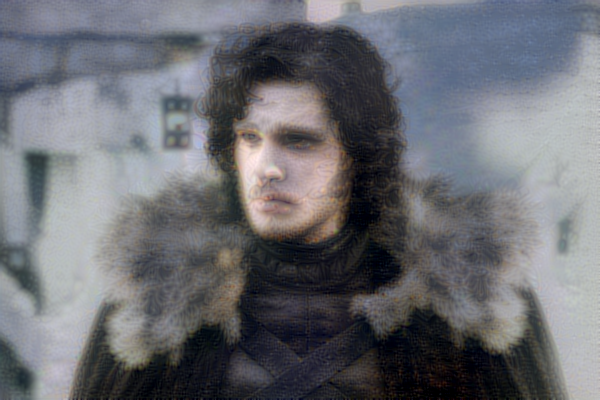

# Środowisko

Dzięki nvidia-docker stosunkowo łatwo doprowadziłem do działania obliczenia na
GPU. Wygenerowałem w tym celu obraz z Dockerfile:
```Dockerfile
FROM tensorflow/tensorflow:latest-gpu-py3

RUN pip3 install --upgrade pip

WORKDIR /workdir
COPY requirements.txt /workdir/

RUN pip3 install -r <(grep -v tensorflow requirements.txt)

COPY . /workdir/
```
i uruchamiałem komendą
```bash
docker run --runtime=nvidia -it -v $(pwd):$(pwd) --workdir $(pwd) -u $(id -u):$(id -g) tfgpu:0.3O
```

# Zadanie 1

Przygotowana funkcja generuje dla każdej warstwy podgląd 32 kanałów.
Kanały są równomiernie spośród wszystkich dostępnych, np. dla wartstwy o 960
kanałach pokazywany jest co trzydziesty.

Dla sieci ImageNet:

\ 

# Zadanie 2

Wszystkie ilustracje zostały przeskalowane do kwadratowych proporcji, analogicznie jak
to robi skrypt.

## Space shuttle

Dokładność osiągnięta bez zaciemnienia: 86.09594%

{width=224px}
{width=240px}

## Axolotl

Dokładność osiągnięta bez zaciemnienia: 96.48967%

{width=224px}
{width=240px}


# Zadanie 3

## Zdjęcie i wzorzec stylu:

{width=224px} {width=224px}\ 

## Wynik transferu:

{width=224px}\ 

## Zdjęcie i wzorzec stylu:

{width=224px} {width=224px}\ 

## Wynik transferu:

{width=224px}\ 


## Aktywacja warstw
\ 


## Wartości funkcji straty

### Domyślne wagi
```python
content_weight = 0.025
style_weight = 1.0
tv_weight = 1.0
```
{width=224px}

```
Dla domyślnych wag:
Start of iteration 0
Current loss value: 893708500.0
Start of iteration 1
Current loss value: 462312320.0
Start of iteration 2
Current loss value: 366881730.0
Start of iteration 3
Current loss value: 328560830.0
Start of iteration 4
Current loss value: 305369100.0
Start of iteration 5
Current loss value: 290426270.0
Start of iteration 6
Current loss value: 279828030.0
Start of iteration 7
Current loss value: 271162560.0
Start of iteration 8
Current loss value: 263860100.0
Start of iteration 9
Current loss value: 257983870.0
```


### Zmodyfikowane wagi
```python
content_weight = 0.1
style_weight = 0.8
tv_weight = 0.6
```

{width=224px}

```
Start of iteration 0
Current loss value: 648703100.0
Start of iteration 1
Current loss value: 369939940.0
Start of iteration 2
Current loss value: 292248670.0
Start of iteration 3
Current loss value: 265809180.0
Start of iteration 4
Current loss value: 248629860.0
Start of iteration 5
Current loss value: 236871890.0
Start of iteration 6
Current loss value: 227503070.0
Start of iteration 7
Current loss value: 220876220.0
Start of iteration 8
Current loss value: 215173800.0
Start of iteration 9
Current loss value: 210685250.0
```

### Zmodyfikowane wagi 2
```python
content_weight = 0.8
style_weight = 0.1
tv_weight = 1.0
```

{width=224px}

```
Start of iteration 0
Current loss value: 458016200.0
Start of iteration 1
Current loss value: 316416200.0
Start of iteration 2
Current loss value: 274098020.0
Start of iteration 3
Current loss value: 252416030.0
Start of iteration 4
Current loss value: 239881980.0
Start of iteration 5
Current loss value: 231452700.0
Start of iteration 6
Current loss value: 225596460.0
Start of iteration 7
Current loss value: 220817490.0
Start of iteration 8
Current loss value: 217032500.0
Start of iteration 9
Current loss value: 213759070.0
```
