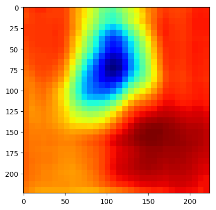
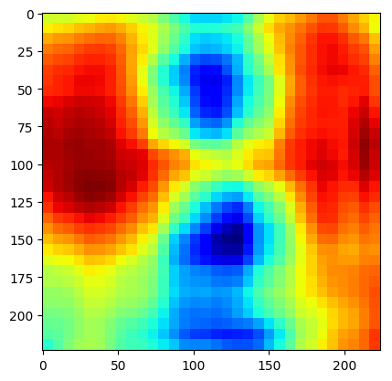

# Środowisko

Dzięki nvidia-docker stosunkowo łatwo doprowadziłem do działania obliczenia na
GPU. Wygenerowałem w tym celu obraz z Dockerfile:
```Dockerfile
FROM tensorflow/tensorflow:latest-gpu-py3

RUN pip3 install --upgrade pip

WORKDIR /workdir
COPY requirements.txt /workdir/

RUN pip3 install -r <(grep -v tensorflow requirements.txt)

COPY . /workdir/
```
i uruchamiałem komendą
```bash
docker run --runtime=nvidia -it -v $(pwd):$(pwd) --workdir $(pwd) -u $(id -u):$(id -g) tfgpu:0.3O
```

# Zadanie 1

Przygotowana funkcja generuje dla każdej warstwy podgląd 32 kanałów.
Kanały są równomiernie spośród wszystkich dostępnych, np. dla wartstwy o 960
kanałach pokazywany jest co trzydziesty.

Dla sieci ImageNet:

\ 

# Zadanie 2

Wszystkie ilustracje zostały przeskalowane do kwadratowych proporcji, analogicznie jak
to robi skrypt.

## Space shuttle

Dokładność osiągnięta bez zaciemnienia: 86.09594%

{width=224px}
{width=240px}

## Axolotl

Dokładność osiągnięta bez zaciemnienia: 96.48967%

{width=224px}
{width=240px}

